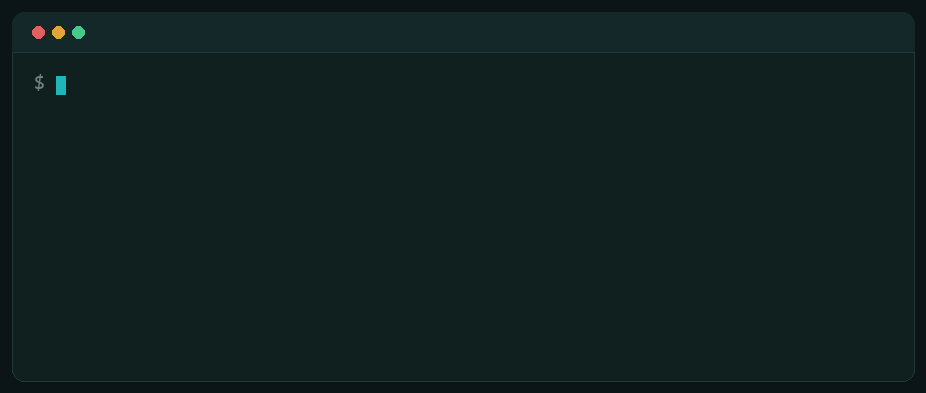
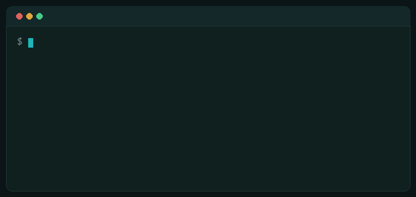
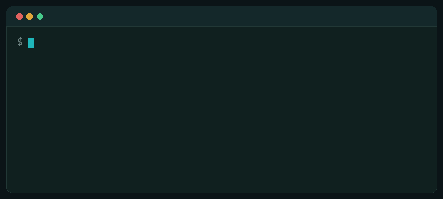
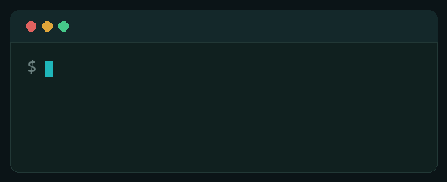
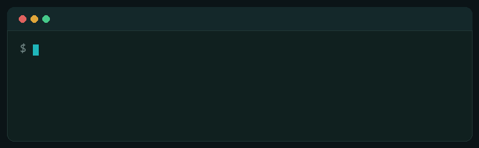
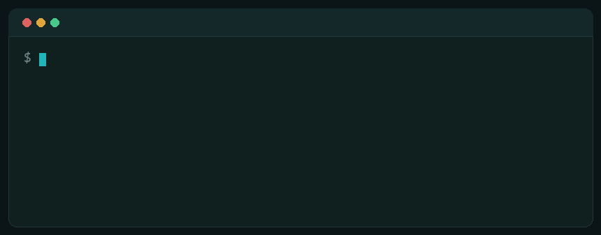

<div align="center">

# delta-peacock

### The code review that enforces your rules, not an LLM's opinion.

**Your guidelines. Any SCM. Any model. One deterministic exit code.**

[](#development)
[](#development)
[](LICENSE)
[](#quick-start)
[](#security-and-privacy)

</div>

---

Most AI reviewers answer one question: _what does a model think of this diff?_ delta-peacock answers a sharper one:

> **Does this change violate the rules your team wrote down, and should the build fail?**

It reviews pull requests against guidelines your team keeps as markdown in its own repository. Every finding cites the guideline it breaks and **inherits that guideline's severity**, so the model can never invent importance. The gate is a real exit code. There is no server, no account, and no telemetry: it runs as a single stateless CLI in any CI pipeline, or locally in your terminal without ever touching a pull request.

<div align="center">



**[▶ Live feature tour](https://nicolacarkaxhija.github.io/delta-peacock/)** &nbsp;·&nbsp; every clip below is real captured output, no mock-ups

</div>

## Table of contents

- [Why delta-peacock](#why-delta-peacock)
- [Quick start](#quick-start)
- [How it works](#how-it-works)
- [What ships](#what-ships)
- [Continuous integration](#continuous-integration)
- [Configuration](#configuration)
- [Security and privacy](#security-and-privacy)
- [How it compares](#how-it-compares)
- [Documentation](#documentation)
- [Development](#development)
- [License](#license)

## Why delta-peacock

The market is full of capable review assistants. None of them treats your written standards as an enforceable contract. That is the axis delta-peacock owns.

|                                                                               | delta-peacock | Typical AI reviewer     |
| ----------------------------------------------------------------------------- | ------------- | ----------------------- |
| Severity is set by **your** guideline and gates the build                     | Yes           | Model opinion, advisory |
| Guidelines read from the **target ref**, so a PR cannot weaken them           | Yes           | Rarely                  |
| Runs with no server, no telemetry, any local model                            | Yes           | SaaS, per seat          |
| Pre-flight per-review and monthly **spend caps**                              | Yes           | No budget concept       |
| Deterministic JSON report plus SARIF, GitLab Code Quality, Bitbucket Insights | Yes           | Comments only           |
| Idempotent comments via stable **fingerprints**                               | Yes           | Often duplicates        |
| Multi-model **ensemble** with judge reconciliation                            | Yes           | Single model            |

Position it as the **policy gate**, not the general assistant: for teams that already write standards down and want them enforced deterministically, self-hosted, on any model, with a spend ceiling.

## Quick start

Requires [Node.js](https://nodejs.org) 22.12 or newer.

```bash
# 1. Scaffold config, an example guideline, and a CI snippet for your host.
npx delta-peacock init          # or: init --walkthrough for guided setup
                                #     init --starter <pack> to seed from a curated pack

# 2. Point it at a model (any provider; a local one works too).
export DELTA_PEACOCK_MODEL_ID=claude-sonnet-4-5
export ANTHROPIC_API_KEY=...

# 3. Validate the whole install before spending a token.
npx delta-peacock doctor

# 4. Review the current branch. Exit 2 means a violation crossed your threshold.
npx delta-peacock review --fail-on MAJOR
```

A real review, gating a build:

```text
$ delta-peacock review --fail-on MAJOR
BLOCKER  src/config.js:3  [no-secrets-in-code] Hard-coded credential
         Move this token to an environment variable; never commit secrets.
MAJOR    src/config.js:6  [rhino-compat] Optional chaining unsupported on the SFCC backend
         Rhino does not support ?.; use an explicit guard.

2 finding(s)
gate: failOn=MAJOR FAILED (2 at or above threshold)   # exit code 2
```

## How it works

**Guidelines are the contract.** A guideline is a markdown file with a small frontmatter header, versioned inside the repo it governs. `id` and `severity` are always required; `languages` and `paths` scope the rule to matching changed files and are optional — omit either and it defaults to matching everything:

```markdown
---
id: no-secrets-in-code
severity: BLOCKER
languages: [javascript]
paths: ["src/**"]
---

# No secrets in committed code

Credentials, tokens and API keys must come from the environment, never a literal in source.
```

**`review.frontmatterContract`** governs what happens when `languages` or `paths` is missing. `lenient` (the default) keeps the rule — applying it everywhere — and prints a notice naming the rule and the missing field(s), so an unscoped rule is seen rather than silently misfiring. `strict` skips the rule entirely with a warning instead, matching the older, stricter contract some teams migrate from.

**Structural checks.** A guideline whose claim is about where code sits can opt into a deterministic AST check: `structural: no-declaration-in-loop` or `structural: module-scope-only`. A violation citing it is dropped when the parsed JavaScript contradicts the claim, for example a declaration flagged as in a loop body that sits in a callback, or a module-scope-only finding inside a function. Unparseable source keeps the finding. `review` and `bench` both apply it. The seed packs carry none, since none of their rules is about scope.

**Tamper resistance.** By default the corpus is read from the **merge target**, so a pull request cannot weaken the rules that judge it. So is `delta-peacock.config.yaml` whenever the host names the target (`DELTA_PEACOCK_REVIEW_TARGET` or `--target`): the reviewer fetches it and reads the file as the target branch holds it, falls back to the working tree only while the target has none yet, and says which one it used. `DELTA_PEACOCK_CONFIG_FROM=source` keeps the working tree copy for local experiments. Language and path scoping keep each rule to the files it governs, and a violation citing a guideline whose scope excludes the flagged file is dropped deterministically.

**Every finding sits on the line it quotes.** The model quotes the source line each finding is about. The reviewer looks that line up in the file at the reviewed commit and moves the finding there; a quote that is missing, not in the file, or on several lines puts the finding in the summary with a note instead of on a line it may not mean. A suggestion replaces exactly the quoted line or is left out with a note, and it is left out too when it brings in a tag the repository does not declare or an import the repository does not have. A finding on code that its own guideline shows verbatim as a Good example is dropped. When the reviewed repository has a `test-runner.config.ts` (`review.repoConfigPath`, empty turns it off), its feature tags (`tags.features`) and axis tags (`@site:`, `@env:`, `@device:`, `@locale:` and their `@not-` forms) go into the prompt as the only tags that exist; the file is read as text, never run.

**Every finding quotes its rule.** Next to the source line, each violation copies into `guidelineQuote` the sentence of its guideline that the code breaks. The reviewer looks that sentence up in the guideline file, with whitespace, emphasis marks and wrapping quotes ignored, and drops the finding when the guideline does not say it: a paraphrase that makes a rule stricter ("not semicolons" where the guideline says "not dashes") never reaches the pull request. Each drop counts as a reviewer error in the stats ledger (`errors.misquoted`) and in the report (`droppedMisquotedFindings`). A suggestion keeps every piece of information of the line it replaces, so shortening a comment never drops its reason, and a reason comment counts wherever it sits: on the line, on the line above, or in the doc comment of the enclosing declaration or of the group of declarations it heads.

**A reply without JSON is asked once more.** When the answer holds no findings object, the reviewer repeats the answering step once with the files the model had fetched replayed as text. If that fails too, the pull request gets a summary saying the review could not complete and why, and a failed status, instead of a silent pipeline error.

**A gate, not a suggestion box.** Findings are compared against your `failOn` threshold. The exit code is the outcome: `0` clean or advisory, `1` a tool error, `2` a gate failure. Everything downstream of the findings is deterministic: the threshold test, the report, the fingerprints, and the scope drops. The findings themselves come from a model, so they run at temperature zero and reuse the response cache on an unchanged changeset; a fresh review is as reproducible as the provider allows, and no more.

**Auditable by construction.** Comments carry a stable fingerprint marker, so re-runs update or resolve rather than duplicate. The JSON report is a plain artifact you can diff, archive, or feed into other tools, and it also renders to SARIF, GitLab Code Quality, and Bitbucket Code Insights.

## What ships

**Source control.** GitHub, GitLab, and Bitbucket Cloud adapters plus a local mode. Idempotent inline and summary comments, native suggestion blocks, commit statuses, Bitbucket Code Insights, and a hard `--dry-run` that never emits a single outbound request.

**Models.** Anthropic, Amazon Bedrock, OpenRouter, and any OpenAI-compatible host including local models (Ollama, vLLM). Multi-model **ensemble** review with union or judge merging.

**Cross-file awareness.** A zero-cost deterministic repo map by default, the full post-change text of every changed file, on-demand agentic tools, and retrieval that runs on lexical TF-IDF or real embeddings behind a pluggable port. Strategies layer, and a prompt budget ledger keeps the assembled request inside the model's window, degrading in a documented order.

**Governance and cost.** An in-process cost guard with per-review and monthly spend caps checked against real usage, secret and PII redaction before anything reaches a model, an optional response cache for re-triggered runs, and a stable prompt prefix so provider-side caching keeps hitting.

**The command surface** (`delta-peacock --help`):

| Command      | What it does                                                                                                                                          |
| ------------ | ----------------------------------------------------------------------------------------------------------------------------------------------------- |
| `review`     | Gate a branch against its guidelines. `--staged` for pre-commit, `--bootstrap` for an empty corpus, `--write-baseline` to adopt on legacy code.       |
| `audit`      | Review the whole tree, not just a diff.                                                                                                               |
| `describe`   | Generate the PR description from the change, idempotently.                                                                                            |
| `ask`        | Question the changeset in the terminal, one-shot or a session.                                                                                        |
| `fix`        | Apply report suggestions to the working tree or a patch file.                                                                                         |
| `waive`      | Insert an in-code waiver for a finding: a person's deliberate, always-reported exception.                                                             |
| `learn`      | Turn team reactions into proposed guideline drafts.                                                                                                   |
| `stats`      | Per-contributor findings, normalized per changed line. A coaching aid. [Ledger format](docs/guides/stats-ledger.md).                                  |
| `guidelines` | `lint`, coverage `stats`, `pack` authoring, and legacy `import`.                                                                                      |
| `doctor`     | Validate the whole install without reviewing anything.                                                                                                |
| `init`       | Scaffold config, a guideline, and a CI snippet. `--walkthrough`, `--starter`.                                                                         |
| `bench`      | Score the reviewer against benchmark cases.                                                                                                           |
| `backtest`   | Replay real pull requests and fail on any finding a person judged wrong, on drift, or on recall under the last run. [Guide](docs/guides/backtest.md). |
| `config`     | Resolve and print the effective configuration.                                                                                                        |

<details>
<summary><b>See it in motion</b> — recorded command sessions</summary>

<br>

**Machine-readable report with stable fingerprints**



**SARIF 2.1.0 for GitHub code scanning**



**Apply a suggestion to the working tree**



**Lint the guideline corpus, with a machine-checkable warning**



**Validate the whole install before spending a token**



</details>

## Continuous integration

GitHub Actions, gating pull requests:

```yaml
name: delta-peacock
on: pull_request
jobs:
  review:
    runs-on: ubuntu-latest
    steps:
      - uses: actions/checkout@v4
        with: { fetch-depth: 0 } # full clone so the merge base resolves
      - uses: actions/setup-node@v4
        with: { node-version: 24 }
      - run: npx delta-peacock review --fail-on MAJOR
        env:
          ANTHROPIC_API_KEY: ${{ secrets.ANTHROPIC_API_KEY }}
          GITHUB_TOKEN: ${{ secrets.GITHUB_TOKEN }}
          DELTA_PEACOCK_SCM_PROVIDER: github
          DELTA_PEACOCK_SCM_REPOSITORY: ${{ github.repository }}
          DELTA_PEACOCK_SCM_PULL_REQUEST: ${{ github.event.pull_request.number }}
```

GitLab CI and Bitbucket Pipelines recipes, a Jenkins snippet, code-scanning artifacts, and a pre-commit hook (`review --staged`) are in the [CI recipes guide](docs/guides/ci-recipes.md).

## Configuration

Configuration is layered: built-in defaults, then a `delta-peacock.config.yaml`, then `DELTA_PEACOCK_*` environment variables, then CLI flags. Secrets never live in the config file; they come from the environment. A JSON Schema ships for editor autocomplete, and `delta-peacock config` prints the effective result.

```yaml
model:
  provider: anthropic
review:
  target: main
  guidelinesDir: guidelines
gate:
  failOn: MAJOR
cost:
  maxPerReview: 0.50 # block a review estimated above this, before any model call
```

### Context strategies

`context.provider` picks one strategy; `context.providers` layers several in order, and earlier ones win the shared `context.maxTokens` budget (approximate tokens, default 4000).

| Strategy     | What the model gets                                                                                        | Extra model calls |
| ------------ | ---------------------------------------------------------------------------------------------------------- | ----------------- |
| `repo_map`   | Signatures elsewhere in the repository that the change touches                                             | none              |
| `full_files` | The whole post-change text of every changed text file; smallest first, the largest truncated with a marker | none              |
| `agentic`    | Tools to list, read and search repository files on demand, bounded by `context.maxToolRounds`              | tool rounds       |
| `scope`      | The enclosing function or loop of each changed line, from the AST                                          | none              |
| `rag`        | Chunks retrieved by TF-IDF or embeddings                                                                   | embeddings only   |

`full_files` skips deleted, binary and out-of-tree paths and never reads a file larger than 1 MB. Paired with `agentic`, the model starts from the whole changed files and fetches only what lies outside them:

```yaml
context:
  providers: [full_files, agentic]
  maxTokens: 8000
  maxToolRounds: 10
```

### How the review reads on a pull request

The reviewer posts under a name your readers see instead of the tool's: `review.displayName` (default `Code review`, env `DELTA_PEACOCK_REVIEW_DISPLAY_NAME`) names the commit status and the Bitbucket Code Insights report, and nothing else; the comments carry no heading, since their author already says who wrote them. `review.guidePath` (default `docs/reviews.md`, env `DELTA_PEACOCK_REVIEW_GUIDE_PATH`) is the repository doc a blocked summary links to; when the file does not exist the link is left out.

```yaml
review:
  displayName: Automated review
  summaryWhenClean: false
```

Every outcome renders through one summary template whose first line is the verdict: `No issues found in this change.`, `Nothing in scope was changed.` when no file under `review.include` changed, `The review could not complete: <reason>.` when the run broke off, or a count line (`2 findings: 1 major, 1 minor`) followed by one line per finding. A gate line appears only when the gate blocks (`Blocked: a major finding must be resolved.`), followed by the link to the guide. The Insights card says the same in one line. The commit status keeps the name from `review.displayName` and describes the run in one plain line that opens with its verdict: `Passed. No findings in 4 changed files.`, `3 findings, 1 major. See the comments.` (major counts findings at MAJOR or above), `Passed. No reviewable files in this change.`, `Passed. No guidelines to review against.`, `Skipped. The change is too large to review.`, `Skipped. The monthly cost cap is reached.` when a cost cap stops the run (a failed status unless `gate.failOn` is `none`), or `Failed. The review could not complete: <reason>.` Where a Code Insights card carries the result (Bitbucket), a run without findings posts no summary comment and only turns an earlier summary of the reviewer's clean; `review.summaryWhenClean: true` (env `DELTA_PEACOCK_REVIEW_SUMMARY_WHEN_CLEAN`) posts it anyway. Each inline comment opens with the severity in bold and the guideline id linked to `<guidelinesDir>/<id>.md` on the target branch, gives the reason in one or two sentences, and shows a suggested change in a fenced block. Titles and reasons carry no dashes as punctuation and no "According to the guideline" opener.

Re-runs update comments in place. GitHub and GitLab hide HTML comments, so an invisible marker identifies the reviewer's comments there. Bitbucket prints them as text, so there the reviewer's comments are recognised by their author (the token's user), file, line and the guideline id in their first line, and carry no marker. A repository access token cannot call Bitbucket's `GET /user`, so the reviewer learns its own user from a draft comment it deletes at once; nobody sees it. A finding that is gone deletes its comment, or resolves it when someone replied; a thread someone resolved is left alone and its finding is not posted again. On Bitbucket `describe` fences its section with a visible `### Change summary` heading and a closing italic line instead of hidden markers.

**Pull request tasks (Bitbucket).** With `scm.tasks: true` (env `DELTA_PEACOCK_SCM_TASKS`, default off) every posted finding also gets a pull request task on its comment, one line with the severity, the guideline, the file and the line, ending in a short reference the reviewer matches on later runs. A finding never gets a second task. On a later run the reviewer resolves its own task once the anchored line changed at the reviewed commit and leaves it open while the line stands; a finding whose task a person resolved is not posted again. Tasks only become a hard stop through the host: on Bitbucket enable the Premium merge check "Resolve all pull request tasks" on the target branch; the GitHub equivalent is the branch protection rule "Require conversation resolution before merging", which already covers the reviewer's comment threads. Other hosts have no tasks, and the reviewer notes that and carries on.

**Severity words (Bitbucket).** Code Insights annotations know four severities, so on Bitbucket every text the reviewer writes uses them too: the annotations, the report card and its counts, the summary comment, the commit status, the comment headings and the tasks. A pull request with one MAJOR finding behind a MAJOR gate reads `1 finding: 1 high. Blocked: a high finding must be resolved.` and its comment opens with `**High**`. Guidelines, `gate.failOn`, the JSON report and the stats ledger keep the reviewer's own scale.

| Reviewer severity | Bitbucket severity |
| ----------------- | ------------------ |
| BLOCKER           | CRITICAL           |
| CRITICAL          | CRITICAL           |
| MAJOR             | HIGH               |
| MINOR             | MEDIUM             |
| INFO              | LOW                |

BLOCKER and CRITICAL share Bitbucket's top severity, so a card counts them together, and `stats backfill` reads a `**Critical**` heading back as CRITICAL. GitHub shows no severity of its own beside a pull request's comments, and GitLab Code Quality uses the reviewer's five words, so there the reviewer's words stay.

## Security and privacy

- **No telemetry, no phone home.** Nothing about your code or your review leaves the process except the model call you configured.
- **Secrets never in config.** Credentials are read from the environment only, and the loader flags credential-shaped values that slip into config.
- **Best-effort redaction before the model.** Known secret and PII shapes are stripped from the diff before it is ever sent, with the counts recorded in the report, and a strict opt-in adds aggressive matching of secret-named assignments. Pattern matching is not exhaustive by nature, so when nothing at all may leave your network, point the reviewer at a local model instead of relying on redaction alone.
- **A pull request cannot loosen its own review.** Guidelines and `delta-peacock.config.yaml` are read from the target branch. A CI step that installs a committed release tarball should verify it against the checksum file as the target branch holds it, see [Bitbucket Pipelines](docs/guides/ci-recipes.md#bitbucket-pipelines). The pipeline definition itself still comes from the pull request's branch on most hosts, so keep it and the tarball under code owner approval.
- **The dry-run guarantee.** `--dry-run` is enforced before any adapter is built: no comment, status, or write of any kind is emitted, whatever is configured.
- **Bring your own model.** Point it at a local endpoint and no code leaves your network at all.

## How it compares

delta-peacock is deliberately not the chattiest assistant. Tools like Qodo Merge, CodeRabbit, and Kodus offer richer interactivity and more platform breadth. What none of them offers is your written standards as a deterministic gate: severity as policy rather than model opinion, guidelines that a pull request cannot weaken, self-hosting on any model, and a spend ceiling. If that is the gap you need filled, this is the tool that fills it.

## Documentation

| Guide                                             | Read it when                                               |
| ------------------------------------------------- | ---------------------------------------------------------- |
| [Getting started](docs/guides/getting-started.md) | Your first review, in five steps                           |
| [CI recipes](docs/guides/ci-recipes.md)           | Wiring into GitHub, GitLab, Bitbucket, Jenkins, pre-commit |
| [Guideline packs](docs/guides/packs.md)           | Sharing and importing guideline sets                       |

## Development

```bash
pnpm install
pnpm test          # unit tests
pnpm test:coverage # with the 95% coverage gate
pnpm lint && pnpm typecheck
pnpm build         # bundle the CLI to dist/
node dist/cli.js --version
```

After `pnpm install`, git hooks rerun `pnpm install` on a checkout or merge that changes `pnpm-lock.yaml`, and stay a no-op otherwise. For a guided read of the code in VS Code, open the CodeTour in `.tours/` (the recommended `vsls-contrib.codetour` extension).

**Coverage measures engineering, not efficacy.** `pnpm test` and the 95% gate exercise the pipeline, parsing, gating, and redaction plumbing with the model faked, so they prove the machinery is correct. They do not measure whether the reviewer catches real violations. That is a separate question, and `bench` answers it: it scores the reviewer against the case corpus in [bench/cases](bench/cases), and the [bench-smoke workflow](.github/workflows/bench-smoke.yml) runs those cases against a live model on demand, failing when the aggregate score regresses. Published precision and recall come from that live run, not from the coverage number.

Commits follow the [conventional commit](https://www.conventionalcommits.org) format, enforced by a hook; the changelog and versioning are generated from them. Contributions are welcome: open an issue to discuss a change, keep the coverage gate green, and match the docs registries.

### Publishing

release-please cuts releases from the conventional commits; the [release checklist](docs/guides/release-checklist.md) is the human part. A release builds the GHCR image, and publishes to npm once the `NPM_PUBLISH` repository variable is `true` (off until the public flip).

The npm tarball bundles every runtime dependency at its lockfile version, so it installs with no registry access and with `--ignore-scripts`. Build it with `pnpm pack:bundled`, never a plain `npm pack`, which would sweep in the whole pnpm store. To publish by hand from a clean checkout of the release commit, after `pnpm install`:

```bash
pnpm pack:bundled
npm publish delta-peacock-<version>.tgz
git tag v<version>
git push origin v<version>
```

#### History purge before going public

**Do not make this repository public before this purge has run:** early history holds benchmark fixtures copied from a client codebase (18 commits, 32 paths under `bench/cases/*-l360-*`), replaced by synthetic cases since 0.1.1.

Run it only on the owner's explicit order, from a fresh mirror clone, with [git filter-repo](https://github.com/newren/git-filter-repo):

```bash
git clone --mirror git@github.com:nicolacarkaxhija/delta-peacock.git dp-purge.git
cd dp-purge.git
printf 'regex:(?i)\\bl360\\b==>storefront\n' > ../dp-replace.txt
git filter-repo \
  --invert-paths --path-glob 'bench/cases/*-l360-*' \
  --replace-text ../dp-replace.txt \
  --replace-message ../dp-replace.txt
git log --all --oneline -i -S l360          # expect no output
git log --all --oneline -i --grep l360      # expect no output
git remote add origin git@github.com:nicolacarkaxhija/delta-peacock.git
git push --force --mirror origin
```

The force push rewrites every branch and tag: every existing clone must be re-cloned, and open pull requests must be closed first (GitHub keeps `refs/pull/*` and their blobs until GitHub Support purges them). Delete this section in the first commit after the purge.

## License

[Apache-2.0](LICENSE).
